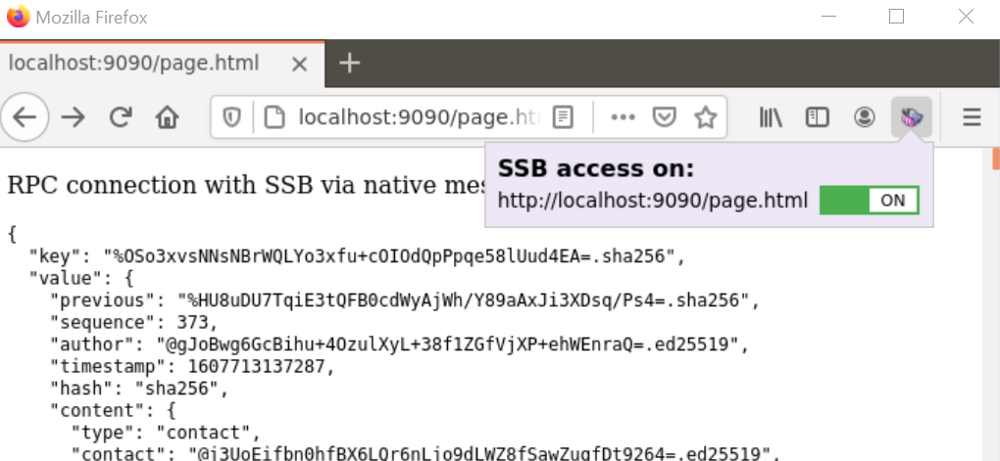

# Scuttle Shell Browser

Scuttle Shell Browser provides [Browser Extension](https://developer.mozilla.org/en-US/docs/Mozilla/Add-ons/WebExtensions) 
that allows web pages to access the [Scuttlebutt Network](https://scuttlebutt.nz/).

Currently only Firefox is supported.

## How to use it

- You need to have a Scuttlebutt client such as [patchwork](https://github.com/ssbc/patchwork) running on you computer.
- you need to install the native messaging host, for this run `npx scuttle-shell-browser`
- install the extension in your browser by choosing the latest xpi in the [release section on github](https://github.com/retog/scuttle-shell-browser/releases)

Once installed, youhave a context menu that allows you to give a page access to Scutttlebutt.

Now you might access [https://retog.github.io/scuttle-shell-browser/](https://retog.github.io/scuttle-shell-browser/)
for some example pages that access Scuttlebutt.

## How it works

This projet provides a webextension that allows accessing scuttlebutt from scripts in websites.

An script running on the Host provides an RPC connection to scuttlebutt via native messages. The web exension allows to decide which pages can access Scuttlebutt.

This extension includes a content script, which is injected into the accessed pages. This
content script provides an api that can be accessed from any page using a [muxrpc](https://github.com/ssb-js/muxrpc) connection.

The communication uses the page to extension messaging described at https://github.com/mdn/webextensions-examples/tree/master/page-to-extension-messaging, builds [pull-streams](https://github.com/pull-stream/pull-stream) on top of those messages and uses these streams for the RPC connection.

## Developing

This folder contains 3 projects that can be built independently. For the [web extension](web-extension) to work the 
[native messaging host](native-messaging-host) must be installed on the computer. Examples of webpages accessng Scuttlebutt are in the [consumer](consumer) folder.

